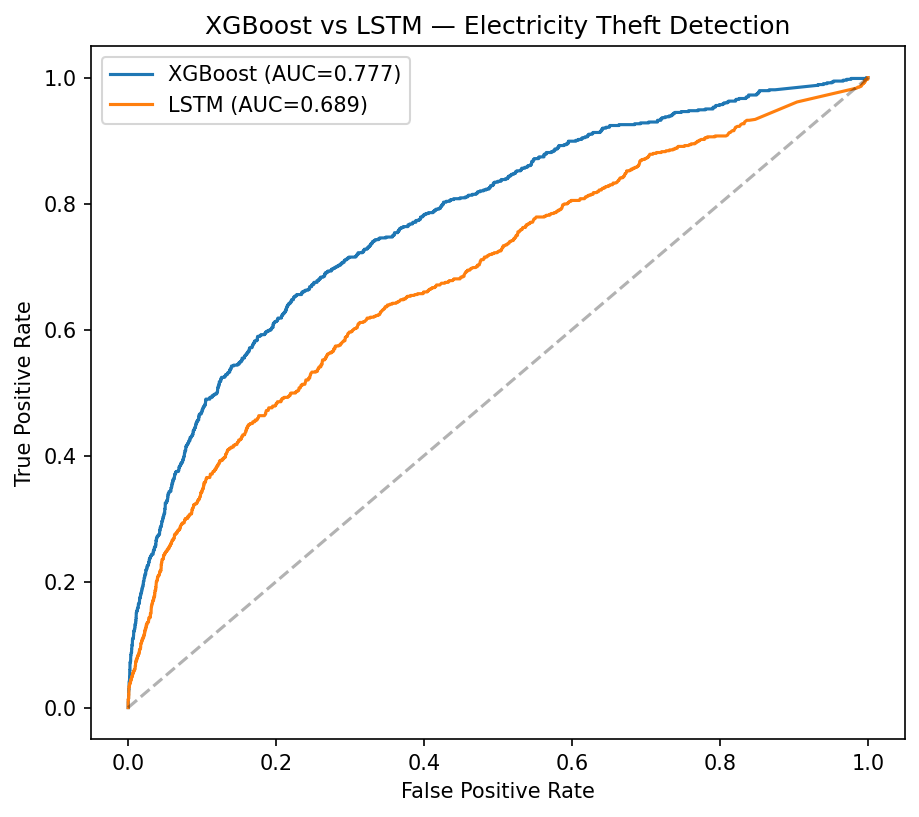
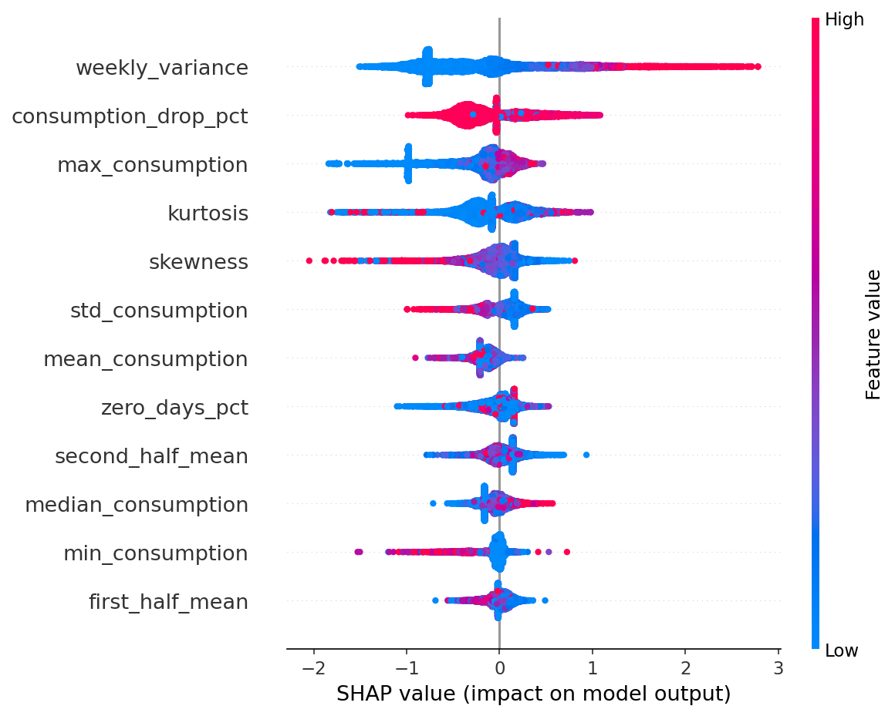
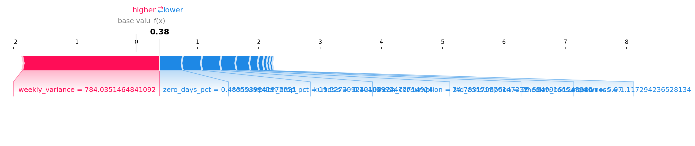

# VidyutRakshak — AI-Powered Electricity Theft Detection

**ML Bubble 2026 — Machine Learning Awareness & Skill Building Challenge**  
Army Institute of Technology (AIT), Pune  
Team: Kaivalya  

---

## Submission Requirements Checklist

- [x] **Project Presentation (PPT/PDF)** — see `PPT/Explainable-AI-for-Electricity-Theft-Detection-Built-for-India.pptx.pptx`
- [x] **Source Code** — see `VidyutRakshak_—_Electricity_Theft_Detection.ipynb`
- [x] **Dataset Details** — see "Dataset" section below, and `metrics.json`
- [x] **Model Performance Metrics** — see `metrics.json` and "Results" section below
- [x] **Project Documentation** — see `docs/VidyutRakshak_Documentation.docx`
- [x] **GitHub Repository Link** — [github.com/omkar-103/vidyutrakshak-theft-detection](https://github.com/omkar-103/vidyutrakshak-theft-detection)

---

## Problem Statement

Electricity theft and non-technical losses cost Indian power distribution companies (DISCOMs) an estimated ₹1.5 lakh crore annually. Current detection relies heavily on manual field inspections, which are slow, expensive, and easy to evade. VidyutRakshak uses machine learning on smart meter consumption data to flag likely theft cases automatically, with **explainable risk scores** that field inspectors can act on with confidence — not just a black-box "fraud" flag.

## Why This Domain

Most teams gravitate toward healthcare, fraud, or agriculture. Energy & power management is comparatively under-explored despite being one of India's largest and most concrete infrastructure problems, with a natural fit for real ML techniques: time-series anomaly detection, imbalanced classification, and explainability — all directly demanded by this challenge's evaluation criteria.

## Dataset

**SGCC (State Grid Corporation of China) Electricity Theft Detection Dataset** — a public, real-world benchmark dataset containing daily consumption records for 42,372 customers over 1,035 days (Jan 1, 2014 – Oct 31, 2016), with confirmed theft/non-theft labels (~8.5% theft, reflecting real-world class imbalance).

**Important note on dataset origin:** No public Indian DISCOM dataset with confirmed electricity-theft labels currently exists — this data is commercially sensitive and not released publicly by any state utility. SGCC is the standard, most widely cited public benchmark used in electricity-theft-detection research worldwide, and is used here as a training/validation proxy. The pipeline and features are designed to be format-agnostic, so the same approach is intended to be fine-tuned on real Indian DISCOM data (e.g. under India's Smart Metering National Programme, in partnership with utilities like MSEDCL, BSES, or Tata Power) once such labeled data becomes available.

**Citation:** Zheng, Z., Yang, Y., Niu, X., Dai, H.N., Zhou, Y. "Wide and Deep Convolutional Neural Networks for Electricity-Theft Detection to Secure Smart Grids." *IEEE Transactions on Industrial Informatics*, vol. 14, no. 4, pp. 1606–1615, April 2018.

## Methodology

1. **Data cleaning:** Missing values (~25% of the raw dataset) handled via linear interpolation per customer; outliers capped using the 3-sigma rule.
2. **Feature engineering:** 15 human-readable statistical features per customer (mean, std, min, max, median, skewness, kurtosis, zero-consumption-day %, first/second-half consumption drop %, weekly variance, 7-day autocorrelation, 30-day autocorrelation, coefficient of variation) — chosen specifically to remain interpretable for SHAP explainability.
3. **Modeling — architectures & imbalance strategies compared:**
   - **XGBoost** on engineered statistical features with class-weighting via `scale_pos_weight`, hyperparameter tuning via randomized search, and decision threshold optimization.
   - **XGBoost + SMOTE** oversampling comparison to evaluate synthetic oversampling against cost-sensitive class weighting.
   - **LSTM** (sequence-based deep learning) on raw normalized daily consumption sequences to compare explicit statistical feature engineering against direct sequence learning.
4. **Explainability:** SHAP (TreeExplainer) applied to the final XGBoost model for both global feature importance rankings and individual-customer risk score breakdowns.

## Results

| Model | AUC-ROC | F1 (theft class) | PR-AUC |
|---|---|---|---|
| XGBoost (tuned + threshold-optimized) | 0.777 | 0.374 | 0.322 |
| XGBoost + SMOTE | 0.731 | — | 0.298 |
| LSTM | 0.689 | — | — |



### Key Performance Insights
- **Optimal Model Selection:** Tuned XGBoost achieved the top performance with an **AUC-ROC of 0.777**, an **F1 score of 0.374** (for the minority theft class), and a **PR-AUC of 0.322** at an optimized decision threshold of **0.639**.
- **Imbalance Handling:** Class weighting via `scale_pos_weight` outperformed SMOTE oversampling (AUC-ROC 0.731, PR-AUC 0.298), demonstrating that weighting loss during training preserves boundary clarity better than synthetic sample generation on this high-dimensional feature set.
- **Feature Engineering vs Sequence Learning:** XGBoost on engineered features outperformed the LSTM on raw consumption sequences (AUC-ROC 0.689). Explicit statistical metrics (such as weekly variance and drop percentage) capture theft-indicative signatures more effectively than sequence learning alone on 1,035-day daily records.
- **Precision-Recall Benchmark:** Baseline random guessing on this ~8.53% positive-class test set yields a PR-AUC of **0.085**. The final model's PR-AUC of **0.322** represents a **~3.79x improvement over random guessing**.

Full metrics are available in `metrics.json`.

## Explainability Highlights

SHAP analysis identifies `weekly_variance`, `consumption_drop_pct`, and `kurtosis` as the strongest theft-indicative features — consistent with real-world theft patterns such as irregular tampering and abrupt usage drops.

### Global Feature Importance


### Single-Customer Risk Explanation


The SHAP force plot shows exactly how individual statistical factors push a specific customer's risk score higher or lower, providing transparent, auditable evidence for utility field inspection teams.

## Deployment Considerations

- **Data Ingestion:** Designed to plug into smart meter data feeds from Indian DISCOMs under the Smart Metering National Programme.
- **Model Refresh & Feedback Loop:** Field inspector outcomes (confirmed theft vs false positive) are logged to continuously retrain and fine-tune the model on localized Indian consumption patterns.
- **Inspector-Facing Output:** Risk score + SHAP feature breakdown per flagged customer so inspection teams can prioritize high-risk targets with clear rationale.
- **Scalability:** XGBoost inference is lightweight and fast enough to score millions of customer meters in batch or near-real-time.

## Repository Structure

```
vidyutrakshak-theft-detection/
├── README.md
├── VidyutRakshak_—_Electricity_Theft_Detection.ipynb  # Full Colab notebook — cleaning, feature engineering, training, SHAP
├── vidyutrakshak_xgb_model.json                      # Trained final XGBoost model
├── metrics.json                                      # Confirmed performance metrics & deployment notes
├── model_comparison.png                              # XGBoost vs LSTM ROC curve comparison
├── shap_summary.png                                  # Global SHAP feature importance plot
├── shap_individual_example.png                       # Individual customer SHAP force plot explanation
├── PPT/
│   └── Explainable-AI-for-Electricity-Theft-Detection-Built-for-India.pptx.pptx # Final presentation slides
└── docs/
    └── VidyutRakshak_Documentation.docx              # Comprehensive project documentation
```

## Team

**Kaivalya**  
Omkar Parelkar — [github.com/omkar-103](https://github.com/omkar-103) — omkarparelkar@gmail.com

## Submitted For

ML Bubble 2026 — Machine Learning Awareness & Skill Building Challenge, hosted by Army Institute of Technology (AIT), Pune.
